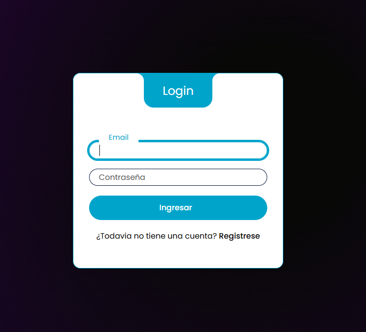
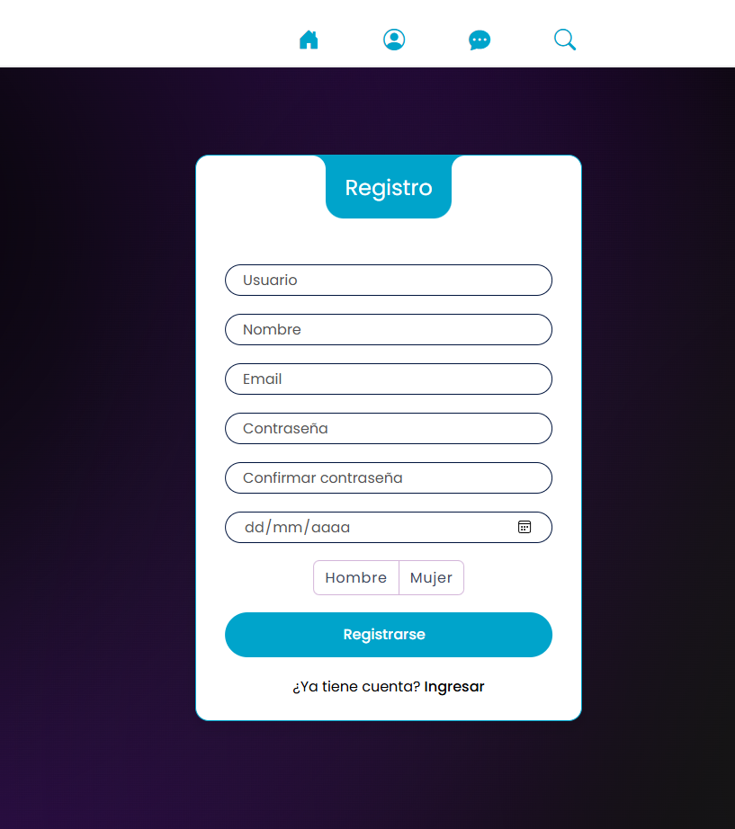

# 🌐 Proyecto Red Social (Full Stack PHP)

Una plataforma de red social funcional desarrollada como proyecto académico para la materia de Programación Web. La aplicación permite a los usuarios interactuar mediante publicaciones multimedia, reacciones, comentarios y un sistema de mensajería en tiempo real.

## 🚀 Características Principales

### 👤 Gestión de Usuarios y Roles (RBAC)
- **Sistema de Autenticación:** Login y Registro seguro.
- **Roles de Usuario:**
  - **Administrador:** Acceso a panel de reportes y gestión global.
  - **Usuario Común:** Interacción estándar con la plataforma.
- **Middleware Personalizado:** Control de acceso y protección de rutas según el rol del usuario.
- **Personalización de Perfil:** Foto de perfil y **foto de portada** (Background).

### 📝 Publicaciones e Interacción
- **CRUD Completo de Posts:** Crear, Leer, Actualizar y Eliminar publicaciones.
- **Soporte Multimedia:** Carga y visualización de imágenes y videos.
- **Descarga de Contenido:** Funcionalidad para descargar las imágenes de los posts.
- **Social:**
  - Sistema de **Reacciones** a publicaciones.

### 💬 Comunicación
- **Chat 1 a 1:** Mensajería directa entre usuarios registrados.

### 📊 Reportes y Utilidades (Admin)
- Dashboard con métricas clave:
  - Cantidad total de Usuarios Registrados.
  - Cantidad total de Publicaciones.

### 🎮 Integraciones (APIs)
- **Entretenimiento:** Integración de APIs de terceros para gamificación.
  - Frases aleatorias de Chuck Norris al iniciar.
  - Minijuego de Trivia con validación en el Frontend.

## 🛠️ Tecnologías Utilizadas

- **Frontend:** HTML5, CSS3, JavaScript (Vanilla).
- **Backend:** PHP (Nativo).
- **Base de Datos:** MySQL (Relacional).
- **Herramientas:** Git, GitHub, MySQL Workbench

## 📷 Capturas de Pantalla
### Login y Registro

### Pagina principal posts

### Perfil

